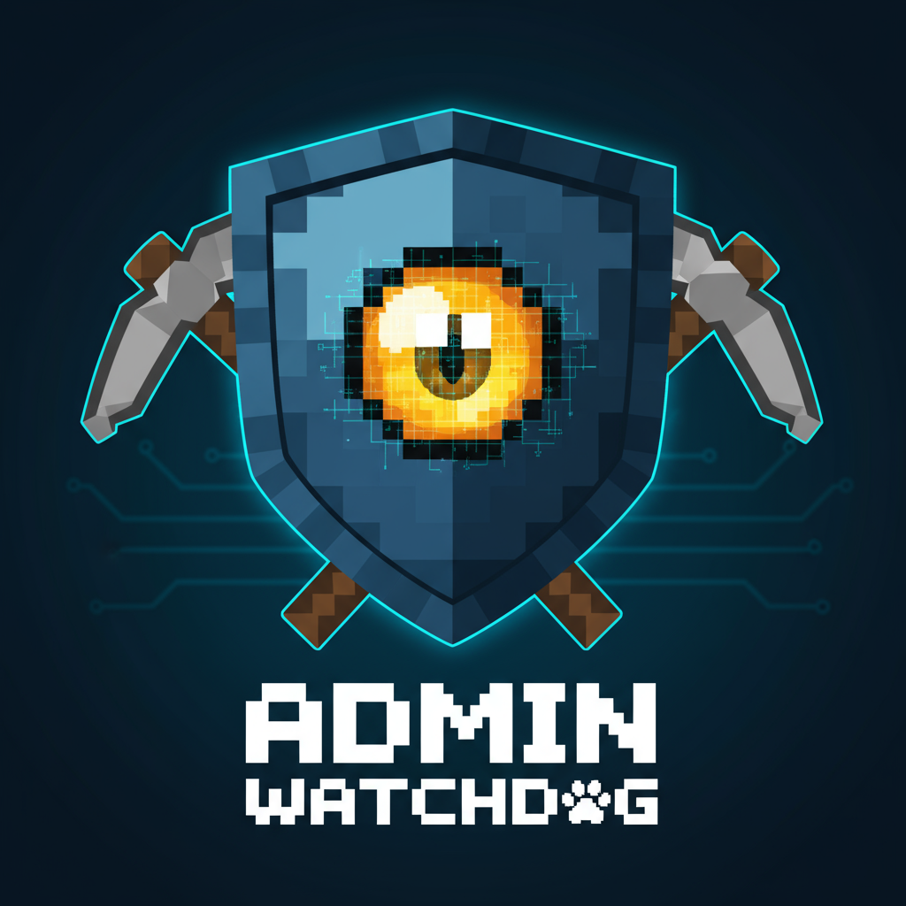

# AdminWatchdog


<div align="center">


**Monitor admin actions and send notifications to Discord**

[Download](https://modrinth.com/plugin/adminwatchdog) | [Documentation](#features) | [Issues](https://github.com/tejaslamba2006/AdminWatchdog/issues)

</div>

---

## Overview

AdminWatchdog monitors administrative actions on Minecraft servers and posts notifications to Discord webhooks. You can set up permission-based monitoring, match commands with wildcard patterns, and everything runs asynchronously so it won't slow down your server.

### Core features

- **Discord webhook integration** - Sends async HTTP POST requests to Discord with embeds
- **Pattern-based command matching** - Use wildcards to match specific commands (like `lp user * permission set *`)
- **Permission-driven monitoring** - Choose who to monitor based on OP status or permissions
- **Creative inventory tracking** - Logs ItemStacks with Guava-cached item metadata
- **Bypass system** - Give trusted admins bypass permissions
- **Async I/O** - Non-blocking file logging and webhook dispatch with CompletableFuture

## Architecture

```
AdminWatchdog
├── CommandListener      # Event handlers for PlayerCommandPreprocessEvent, ServerCommandEvent, etc.
├── ConfigManager        # YAML config with wildcard pattern matching
├── DiscordManager       # Async webhook dispatch with embed builder
├── MinecraftApiHelper   # Guava-cached item data (512-entry LRU, 30-min TTL)
└── UpdateChecker        # GitHub API polling for version checks
```

## Screenshots

### Discord webhook output

**Creative inventory embed**


**Command logging**


**Custom response triggers**


**Gamemode change events**


## Features

### Discord integration

- Webhook POST with JSON payload
- Rich embeds with thumbnails, fields, and color coding
- Role/user mention parsing (`<@&ROLE_ID>`, `<@USER_ID>`)
- Auto-retry async dispatch

### Monitoring subsystems

| Subsystem | Event source | Configurable |
|-----------|--------------|--------------|
| Command monitoring | `PlayerCommandPreprocessEvent` | Yes |
| Console monitoring | `ServerCommandEvent` | Yes |
| Creative inventory | `InventoryCreativeEvent` | Yes |
| Gamemode changes | `PlayerGameModeChangeEvent` | Yes |
| Custom responses | Pattern-matched commands | Yes |

### Wildcard pattern matching

The custom-responses system supports three matching modes:

1. **Exact match** - `ban` matches `/ban`
2. **Prefix match** - `lp user` matches `/lp user Steve permission set fly`
3. **Wildcard match** - `lp user * permission set *` where `*` matches any single argument

Patterns are evaluated by specificity: exact > wildcard > prefix.

### Bypass permissions

Players with bypass permissions won't get logged:

| Permission | Scope |
|------------|-------|
| `adminwatchdog.bypass.commands` | Command logging |
| `adminwatchdog.bypass.creative` | Creative inventory |
| `adminwatchdog.bypass.customresponses` | Custom response triggers |
| `adminwatchdog.bypass.gamemode` | Gamemode change logging |

## Installation

```bash
# Download JAR from releases
wget https://github.com/tejaslamba2006/AdminWatchdog/releases/latest/download/AdminWatchdog.jar

# Put it in your plugins directory
mv AdminWatchdog.jar /path/to/server/plugins/

# Restart server to generate config
```

## Configuration

### config.yml

```yaml
discord:
  webhook-url: "https://discord.com/api/webhooks/..."
  enabled: true
  embeds:
    enabled: true
    creative-inventory: true
    color: "#00d4aa"

# Pattern-based command responses
# Supports wildcards: * matches any single argument
custom-responses:
  enabled: true
  # Basic command matching
  ban: "ADMIN ACTION - %player% used ban at %time%"
  op: "CRITICAL - %player% used OP command! <@&ROLE_ID> at %time%"
  
  # Subcommand matching
  "lp user": "LUCKPERMS - %player% modified user at %time%"
  
  # Wildcard patterns
  "lp user * permission set *": "PERMISSION GRANT - %player%: %command% at %time%"
  "lp user * parent add *": "RANK CHANGE - %player%: %command% at %time%"

monitoring:
  ops: true
  console: true
  gamemode-changes: true
  permissions:
    enabled: true
    list:
      - "adminwatchdog.monitor"
      - "minecraft.command.*"
  creative-inventory:
    enabled: true
    ops-only: false
    permissions-only: false
    detailed-logging: true
  command-blacklist:
    enabled: true
    commands:
      - "login"
      - "register"
      - "password"
```

### Placeholder reference

| Placeholder | Context | Description |
|-------------|---------|-------------|
| `%player%` | Player commands | Player name |
| `%sender%` | Console commands | Sender name |
| `%command%` | All | Full command string |
| `%time%` | All | Formatted timestamp |

## Commands

| Command | Permission | Description |
|---------|------------|-------------|
| `/adminwatchdog version` | `adminwatchdog.use` | Display version info |
| `/adminwatchdog reload` | `adminwatchdog.reload` | Hot-reload configuration |
| `/adminwatchdog update` | `adminwatchdog.update.check` | Query GitHub API for updates |

Aliases: `aw`, `awdog`

## Permissions

| Permission | Default | Description |
|------------|---------|-------------|
| `adminwatchdog.use` | true | Base command access |
| `adminwatchdog.reload` | op | Configuration reload |
| `adminwatchdog.monitor` | op | Subject to monitoring |
| `adminwatchdog.update.check` | op | Manual update checks |
| `adminwatchdog.update.notify` | op | Update notifications |
| `adminwatchdog.bypass.*` | false | All bypass permissions |
| `adminwatchdog.bypass.commands` | false | Bypass command monitoring |
| `adminwatchdog.bypass.creative` | false | Bypass creative monitoring |
| `adminwatchdog.bypass.customresponses` | false | Bypass custom responses |
| `adminwatchdog.bypass.gamemode` | false | Bypass gamemode monitoring |

## Building from source

### Requirements

- JDK 21+
- Gradle 8.x+
- Paper API 1.20.1+

### Build

```bash
git clone https://github.com/tejaslamba2006/AdminWatchdog.git
cd AdminWatchdog
gradle build
# Output: build/libs/AdminWatchdog.jar
```

### Dependencies

```gradle
dependencies {
    compileOnly 'io.papermc.paper:paper-api:1.20.1-R0.1-SNAPSHOT'
    implementation 'com.google.code.gson:gson:2.10.1'
    // Guava provided by Paper runtime
}
```

## Performance notes

- File logging uses `CompletableFuture.runAsync()` to avoid blocking the main thread
- Discord webhooks dispatch asynchronously
- Item metadata cached with Guava `Cache<Material, ItemData>` (512 entries, 30-min TTL)
- Pattern matching uses compiled regex with caching for repeated evaluations

## Contributing

This project uses a proprietary license. Code contributions are not accepted.

**Accepted contributions:**

- Bug reports via GitHub Issues
- Feature requests with detailed use cases
- Documentation improvements via issues

**Not accepted:**

- Pull requests with code changes
- Forks intended for redistribution

For licensing inquiries: [contact](https://github.com/TejasLamba2006)

## Support

1. Check existing [Issues](https://github.com/tejaslamba2006/AdminWatchdog/issues)
2. Join [Discord](https://discord.gg/msEkYDWpXM)
3. Open a new issue with reproduction steps

## License

Proprietary - see [LICENSE](LICENSE)

- Source code viewing permitted
- Modification, redistribution, derivative works prohibited
- Commercial use of compiled plugin permitted

---

<div align="center">

[GitHub](https://github.com/TejasLamba2006/AdminWatchdog) | [Modrinth](https://modrinth.com/plugin/adminwatchdog) | [Discord](https://discord.gg/msEkYDWpXM)

</div>
